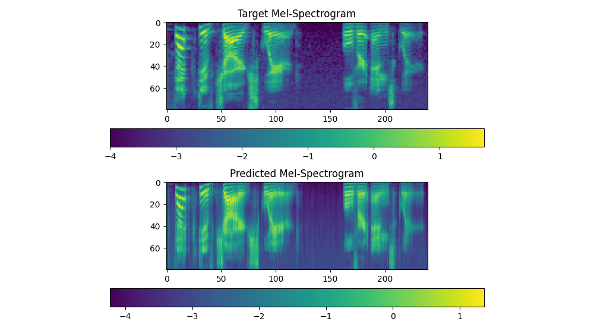

## ML Projects
#### Lip Reader AI
Lip reading AI that generates audio from a video input.
Uses a transformer architecture made in pytorch.

The project took 5-6 months. I worked with one other teammate and was mentored by my teachers. The goal of the project was to make a ml architecture that takes in the feed of frames from a video and trains of the audio to predict audio from silent videos. We utilised Pythons Pytorch library and Google Collab to host the training code.

*sample Wave spectrum of the predicted output compared to the original.*

## AWS Projects
#### VPN
Made a simple vpn using OpenVPN services that allows me to use aws services to act as an exit node from either my phone or my laptop.

#### Dedicated application servers
Hosted a few dedicated servers for games to test out my AWS experience and to explore the automation I can implement using Lambda.

#### Terraform Practice
To practice with HashiCorp Terraform I set up a few servers using Terraform to see the control I have over AWS instances and What all I can do.

## Side Projects
#### Automated 3D printing
Set up octoprint and a 3D printer to allow me to control and print models from anywhere during college. 

#### Scripts for Personal use
Made a lot of personalised scripts using AutoHotKey or Python to do Mundane tasks like webscraping, connecting to APIs, Autfilling Forms, Etc.
